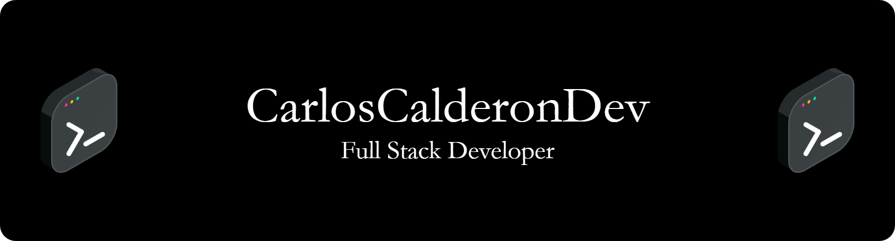

# Carlos Calderón — Full Stack Developer

*Especializado en Backend con Go (Echo) y Frontend con Angular & Astro.*
*Experto en PostgreSQL, Docker y entornos Linux.*

# Sobre mí
Soy Desarrollador Web Full Stack especializado en el diseño de **APIs REST con Go (Echo)** y en la construcción de **frontends escalables con Angular y Astro**. Tengo experiencia en el manejo de **PostgreSQL, Docker y entornos Linux**, aplicando buenas prácticas de arquitectura limpia y código mantenible. Me apasiona el aprendizaje continuo y la creación de soluciones eficientes que aporten valor real a los proyectos.

# Tecnologías y herramientas
* **Backend:** Go (Echo)
* **Frontend:** TypeScript (Angular & Astro)
* **Base de datos:** PostgreSQL
* **DevOps:** Docker, Linux, Git
* **Automatización / Soporte:** Bash & YAML

# Formación y certificaciones

* **Ingeniero de Sistemas – USC (2024)**
* **Certificaciones Platzi:** Rust, Backend con Rust, Frontend Developer, Git y GitHub, Linux.

# GitHub Stats

   
    

      
    

   
    

      
    

   
    

      
    

   
    

      
    

   

# Contacto

* 📧 [E-Mail](mailto:Carlos.Calderon01@Outlook.com) 🔗 [LinkedIn](https://www.linkedin.com/in/carloscalderondev/) 🐙 [GitHub](https://github.com/CarlosCalderonDev)

* 🎥 [YouTube](https://www.youtube.com/@CarlosCalderonDev) 🎮 [Twitch](https://www.twitch.tv/CarlosCalderonDev) 🎮 [Kick](https://kick.com/CarlosCalderonDev) 🎵 [TikTok](https://www.tiktok.com/@CarlosCalderonDev)

* 📘 [Facebook](https://www.facebook.com/CarlosCalderonDev/) 📸 [Instagram](https://www.instagram.com/CarlosCalderonDev/) 🧵 [Threads](https://www.threads.net/@CarlosCalderonDev)

* ✍️ [Medium](https://CarlosCalderonDev.medium.com) 💻 [DEV.to](https://dev.to/CarlosCalderonDev)