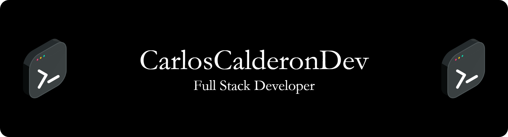

# Carlos Calderón — Web Developer

*Especializado en Backend con Node.js + NestJS y Frontend con React & Next.js.*  
*Experto en PostgreSQL, MongoDB, Docker y entornos Linux.*

# Sobre mí
Desarrollador **Web** con experiencia en **Node.js + NestJS, React + TypeScript, Next.js, PostgreSQL y MongoDB**.  
Aplico principios de programación como **SOLID, Clean Code y Clean Architecture**, enfocándome en el desarrollo escalable y un manejo eficiente de bases de datos.  
He trabajado en proyectos independientes y colaborativos, utilizando **metodologías ágiles** y apoyándome en **inteligencia artificial** para optimizar tareas y mejorar la calidad del código.  
Me adapto fácilmente a nuevos entornos tecnológicos, integrándome en equipos multidisciplinarios y enfocándome en construir aplicaciones robustas y mantenibles.

# Tecnologías y herramientas
* **Backend:** Node.js + NestJS
* **Frontend:** React + TypeScript, Next.js
* **Base de datos:** PostgreSQL, MongoDB
* **DevOps / Entornos:** Docker, Linux, Git
* **Automatización / Soporte:** Python, Bash & YAML
* **Testing:** Unit Tests, E2E Testing

---

# Formación y certificaciones

* **Ingeniero de Sistemas – Universidad Santiago de Cali (2024)**
* **Certificaciones Platzi:** Rust Básico, Backend con Rust, Frontend Developer, Git, Linux, Python y otros.

# GitHub Stats

   
    

      
    

   
    

      
    

   
    

      
    

   
    

      
    

   

# Social media

* 🔗 [LinkedIn](https://www.linkedin.com/in/carloscalderondev/)
* 🐙 [GitHub](https://github.com/CarlosCalderonDev)

* 🎥 [YouTube](https://www.youtube.com/@CarlosCalderonDev)
* 🎮 [Twitch](https://www.twitch.tv/CarlosCalderonDev)
* 🎮 [Kick](https://kick.com/CarlosCalderonDev)
* 🎵 [TikTok](https://www.tiktok.com/@carloscalderondev)

* 📘 [Facebook](https://www.facebook.com/profile.php?id=61580695942536)
* 📸 [Instagram](https://www.instagram.com/CarlosCalderonDev/)
* 🧵 [Threads](https://www.threads.net/@CarlosCalderonDev)
* ✖️ [X (Twitter)](https://x.com/CACB_DEV)
