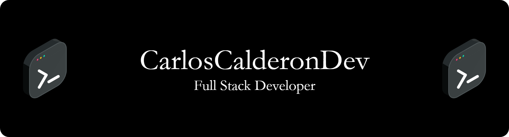

<div align="center">



# Carlos Calderon

### Ingeniero de Sistemas · Desarrollador Web Full Stack

<a href="https://github.com/CarlosCalderonDev"></a>
<a href="https://www.linkedin.com/in/carloscalderondev/"></a>
<a href="mailto:Carlos.Calderon01@Outlook.com"></a>

</div>

## Sobre mí

Construyo aplicaciones web y APIs REST con énfasis en arquitectura limpia, código mantenible y soluciones prácticas. Me gusta aprender en público, documentar mis descubrimientos y compartir flujos de trabajo reales mediante proyectos y transmisiones en vivo.

- Vivo en Colombia y estoy disponible para oportunidades remotas, híbridas o presenciales.
- Me interesa el desarrollo backend, frontend y full stack.
- Ingeniero de Sistemas de la Universidad Santiago de Cali, 2024.

## Mi portafolio

Conoce mis proyectos, experiencia y perfil profesional en mi sitio web personal.

<div align="center">

<a href="https://about-me-vert-five.vercel.app/"></a>

<br>

<a href="https://about-me-vert-five.vercel.app/">https://about-me-vert-five.vercel.app/</a>

</div>

## Mi conjunto de herramientas

<table>
<tr>
<td width="50%">

### Backend

`Node.js` · `NestJS`

### Frontend

`React` · `TypeScript` · `Next.js`

### Datos

`PostgreSQL`

</td>
<td width="50%">

### DevOps

`Docker` · `Linux` · `Git`

### Automatización

`Python` · `Bash` · `YAML`

### Calidad

`Unit Tests`

</td>
</tr>
</table>

## Hoja de vida y documentos profesionales

<div align="center">

| Documento | Enlace |
| --- | --- |
| Hoja de vida | [Descargar PDF](https://github.com/CarlosCalderonDev/CV/blob/main/PDF/CarlosCalderonDevCV.pdf) |
| Fuente del CV | [Abrir fuente LaTeX](https://github.com/CarlosCalderonDev/CV/blob/main/CODE/CarlosCalderonDevCV.tex) |
| Repositorio del CV | [Visitar CarlosCalderonDev/CV](https://github.com/CarlosCalderonDev/CV) |

</div>

## Creación y aprendizaje

Comparto contenido práctico de programación mediante transmisiones en vivo, notas técnicas y publicaciones profesionales. Mi enfoque está en construir proyectos reales, mejorar los flujos de trabajo y aprender continuamente con mi stack principal.

### Descripción de las transmisiones

> Bienvenido a otra sesión de programación en vivo con Carlos Calderon. Acompáñame mientras trabajo en proyectos reales, exploro flujos de trabajo prácticos y comparto lo que aprendo durante el proceso.
>
> **Conéctate conmigo:** [LinkedIn](https://www.linkedin.com/in/carloscalderondev/) · [GitHub](https://github.com/CarlosCalderonDev) · [YouTube](https://www.youtube.com/@CarlosCalderonDev)

## Encuéntrame en línea

| Plataforma | Enlace | Plataforma | Enlace |
| --- | --- | --- | --- |
| LinkedIn | [carloscalderondev](https://www.linkedin.com/in/carloscalderondev/) | YouTube | [@CarlosCalderonDev](https://www.youtube.com/@CarlosCalderonDev) |
| GitHub | [CarlosCalderonDev](https://github.com/CarlosCalderonDev) | Instagram | [@CarlosCalderonDev](https://www.instagram.com/CarlosCalderonDev/) |
| TikTok | [@CarlosCalderonDev](https://www.tiktok.com/@CarlosCalderonDev) | X | [@CACB_DEV](https://x.com/CACB_DEV) |
| Twitch | [CarlosCalderonDev](https://www.twitch.tv/CarlosCalderonDev) | Kick | [CarlosCalderonDev](https://kick.com/CarlosCalderonDev) |
| Facebook | [Perfil](https://www.facebook.com/profile.php?id=61580695942536) | Threads | [@CarlosCalderonDev](https://www.threads.net/@CarlosCalderonDev) |
| Medium | [CarlosCalderonDev](https://CarlosCalderonDev.medium.com) | DEV.to | [CarlosCalderonDev](https://dev.to/CarlosCalderonDev) |

## Guía del repositorio

```text
README.md   Perfil, enlaces, tecnologías y contenido destacado
content/    Publicaciones, redes sociales, notas y plantillas reutilizables
temp/       Archivo local excluido de la presentación pública
```

<div align="center">

### Gracias por visitar mi perfil

⭐ Explora los repositorios, acompaña el proceso y construye algo útil.

</div>
